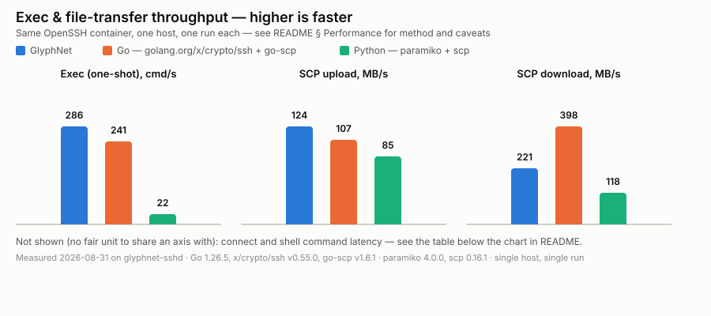

# GlyphNet

GlyphNet is an SSH automation library for [Cangjie](https://cangjie-lang.cn/)
(仓颉) — the Cangjie counterpart to Python's netmiko and paramiko. It exists to
drive network gear and general Linux/Unix hosts over SSH from Cangjie code:
connect to a router or switch, run commands and read the output back, parse
that output into structured records with TextFSM templates, copy files over
SCP, tunnel traffic through the session, and fall back to plaintext Telnet on
gear that offers nothing better.

Cangjie's standard library ships no SSH stack and no usable crypto primitives
to build one on, so GlyphNet wraps libssh2/OpenSSL through Cangjie's C FFI and
builds an idiomatic, netmiko-style API on top of that — see
[How it works](#how-it-works) for why that's the architecture.

```cangjie
import glyphnet.*

main(): Int64 {
    let opts = ConnectionOptions("192.0.2.10", 22, "admin", "secret")
    opts.deviceType = DeviceType.CiscoIOS    // sends "terminal length 0" at login

    try (conn = SSHConnection.connect(opts)) {
        println(conn.findPrompt())            // "Router#"
        println(conn.sendCommand("show version"))
        println(conn.sendCommand("show ip interface brief"))
    }
    return 0
}
```

It also turns out to be quick — see [Performance](#performance) for a
reproducible benchmark against netmiko, paramiko, and Go.

## What it's for

- **Network device automation** — Cisco IOS, Arista EOS, and Juniper JunOS
  presets handle vendor paging/enable/config-mode syntax, and autodetection
  picks the right preset from `show version` if the platform isn't known ahead
  of time.
- **Structured output, not just text** — `sendCommandParsed` runs a command and
  parses it with a TextFSM template (the same template language
  `ntc-templates` uses) in one call.
- **File transfer and tunneling** — SCP upload/download and `-L`/`-R` port
  forwarding, on the same authenticated session as everything else.
- **A Telnet fallback with the same API** — `TelnetConnection` implements the
  same `NetworkConnection` surface as `SSHConnection`, so calling code doesn't
  need to know or care which transport it's actually using.
- **Multiple jobs on one session at once** — `execChannel` for one-shot
  commands alongside the interactive shell, a forwarding pump, and SCP, all
  safe to drive concurrently. Proven under a real concurrent test, not just
  documented as "should be fine."

Every non-trivial claim in this README has a test or a live run behind it —
[Testing](#testing) says exactly what was verified, including against a real
Cisco router, and [Limitations](#limitations) says what wasn't.

## Status

v1, Linux `x86_64` — the only platform this has ever been *run* on. SSH with SCP
file transfer, TextFSM-compatible structured output parsing, and a plaintext
Telnet fallback for gear that offers nothing better. A Winsock socket layer for
Windows exists and cross-compiles, but has never been executed; see
[Platform support](#platform-support) for the precise state of every target.
See [Limitations](#limitations) before using this against anything you care
about — in particular, **host key verification defaults to accept-any**, and
**Telnet is unencrypted by design**.

## Performance



| Benchmark | GlyphNet | Go (`x/crypto/ssh` + `go-scp`) | Python (paramiko/netmiko + `scp`) | GlyphNet vs Python |
| --- | --- | --- | --- | --- |
| Connect — shell + PTY + prompt ready | 356.1ms | no equivalent (see below) | 843.0ms (netmiko) | **2.4x faster** |
| Exec — one-shot, fresh channel | 3.5ms | 4.2ms | 45.6ms (paramiko) | **13.0x faster** |
| Command via persistent interactive shell | 302.1ms | no equivalent | 447.3ms (netmiko) | **1.5x faster** |
| SCP upload, 20 MiB | 124 MB/s | 107 MB/s | 85 MB/s (paramiko + scp) | **1.5x faster** |
| SCP download, 20 MiB | 221 MB/s | **398 MB/s** | 118 MB/s (paramiko + scp) | 1.9x faster, but **Go wins outright** |

All three ran against the same `glyphnet-sshd` OpenSSH container, same host,
one run each. Every program, exact dependency versions, and instructions to
reproduce or challenge these numbers are in [`benchmarks/`](benchmarks/) — the
table above is a summary of that, not the source of truth.

**Read this as data, not a highlight reel:**

- GlyphNet and Go both compile to native code; paramiko/netmiko run on CPython.
  Part of the margin over Python is the language, not the library — which is
  why Go is in this table at all: it's the fair fight. Against Go specifically,
  GlyphNet's lead shrinks to **1.2x on exec** and **1.2x on SCP upload** — and
  **reverses on SCP download, where Go is 1.8x faster than GlyphNet**. That
  number is reported because it's true, not left out because it isn't flattering.
- **Where GlyphNet does lead Go, there's a concrete, source-checked reason —
  not just "compiled beats compiled."** `golang.org/x/crypto/ssh` v0.55.0's
  `session.go` spawns a goroutine per stdio stream it copies (`Start()`/
  `CombinedOutput()` wire up one `go func` per stream being piped, e.g. stdout
  and stderr) plus one more in `newSession()` just to wait on the exit status —
  three goroutine spin-ups and three channel handoffs for one
  `exec_command`-equivalent call, each a trip through the Go scheduler and the
  GC. GlyphNet's
  `glyphnet.ssh2.Session`/`Channel` drive libssh2 from a single-threaded,
  non-blocking poll loop instead — no goroutine-equivalent per call, nothing
  to schedule. That plausibly accounts for the exec and SCP-upload margins
  (checked by reading the installed `x/crypto/ssh` source, not assumed). It
  does **not** explain SCP download, where the goroutine cost is paid once per
  transfer rather than per chunk and Go still wins — that path is dominated by
  something else in `go-scp`'s or `x/crypto/ssh`'s channel-window handling
  that wasn't profiled further here. One real mechanism explaining three rows
  honestly beats one fabricated mechanism "explaining" all six.
- Neither Go's `x/crypto/ssh` nor stock paramiko ships a netmiko-style
  interactive-shell/prompt abstraction, so "connect (shell-ready)" and "command
  via persistent shell" only have a Python comparison — there is nothing
  equivalent to race in stock Go. (`scrapligo` is the closest thing Go has to a
  maintained netmiko-equivalent; benchmarking it is future work, not a
  three-way number faked into this table.)
- One host, one run, over loopback. This is a fixed, rerunnable procedure, not
  a statistically rigorous benchmark suite — rerun [`benchmarks/`](benchmarks/)
  yourself before relying on the exact multipliers.

## How it works

Cangjie's standard library has no SSH stack and, as of SDK 1.0.5, no usable
crypto primitives to build one on: `std.crypto.cipher` is an empty `BlockCipher`
interface with zero bundled algorithms, and there is no Curve25519/X25519 or
Ed25519 anywhere in `std` or `stdx`. Reimplementing SSH's cryptography by hand
would be a large, security-critical undertaking.

So GlyphNet wraps **libssh2** (which gets its crypto from OpenSSL) through
Cangjie's C FFI, and builds an idiomatic Cangjie API on top. This is the same
approach Huawei's own `stdx.crypto.keys` takes with OpenSSL.

```
  glyphnet            SSHConnection / TelnetConnection   (both are NetworkConnection)
                      ConnectionOptions / TelnetOptions
                      CliDriver: prompt, paging, enable and config-mode logic,
                                 shared by both transports over a CliStream
                      DeviceType / DeviceProfile vendor presets
                      LocalForward / RemoteForward, scpUpload / scpDownload
                      TelnetNegotiator (RFC 854 IAC option handling, no crypto)
                      parseTextFsm / TextFsmTemplate: pure TextFSM engine,
                                 no network, no libssh2

     |
  glyphnet.ssh2       Session / Channel / RemoteListener
                      (safe wrappers, libssh2 codes -> exceptions, session lock)
     |
  glyphnet.transport  TcpTransport / TcpListener
                      (raw fds via getaddrinfo/socket/connect/bind/listen/accept4/poll)
     |
  glyphnet.ffi        foreign func declarations for libssh2 + the OS socket API
                      (libc.cj on Linux, libc_windows.cj on Windows -- same
                       names both ways, so nothing above this layer is
                       platform-specific)
     |
  libssh2.so.1  ->  libcrypto (OpenSSL)
```

Telnet enters at `glyphnet.transport` and never touches `glyphnet.ssh2` or libssh2:
it is raw TCP plus option negotiation, written in Cangjie.

### libssh2 symbols behind the forwarding API

Most of libssh2's forwarding "functions" are preprocessor macros over `_ex`
symbols, and a macro name is not something FFI can link against. The real,
`nm -D`-verified symbols GlyphNet declares are:

| Capability | Real symbol | Macro that does *not* exist |
| --- | --- | --- |
| Local forward channel | `libssh2_channel_direct_tcpip_ex` | `libssh2_channel_direct_tcpip` |
| Remote forward listener | `libssh2_channel_forward_listen_ex` | `libssh2_channel_forward_listen` |
| Accept a forwarded connection | `libssh2_channel_forward_accept` | — (already real) |
| Cancel the listener | `libssh2_channel_forward_cancel` | — (already real) |

`libssh2_channel_direct_tcpip_ex(session, host, port, shost, sport)` takes the
target as `host`/`port` and the *originating* endpoint as `shost`/`sport`; the
latter is advisory metadata the server may log, not a routing instruction.

### libssh2 symbols behind SCP

SCP has the same problem plus an ABI that has churned across releases, so the
symbols were read out of the installed library rather than out of a header:

| Capability | Real symbol | Not used, and why |
| --- | --- | --- |
| Upload | `libssh2_scp_send64` | `libssh2_scp_send`/`_ex` are 32-bit-`size_t` era APIs; `_send` is a macro |
| Download | `libssh2_scp_recv2` | `libssh2_scp_recv` fills a 32-bit `stat` and truncates large files |

`libssh2_scp_recv2(session, path, sb)` writes a `libssh2_struct_stat`, which on
Linux is plain `struct stat`. GlyphNet reads only `st_size` out of it, at byte
offset 48 — the one field whose offset is identical on `x86_64` and `aarch64`
glibc. `st_mode` sits at 24 on one and 16 on the other, so it is not read at all;
the download's local file mode comes from the local `File` API instead.

### Why a hand-rolled TCP layer

libssh2 drives its own `recv()`/`send()` against a raw OS file descriptor, so
GlyphNet needs one. Neither standard package can provide it:

- `std.net.TcpSocket` exposes `read`, `write`, `connect`, the `getSocketOption` /
  `setSocketOption` family, `close`, and `isClosed` — but **no accessor for the
  underlying file descriptor**.
- `std.posix` wraps only file and process calls (`open`, `close`, `chmod`,
  `getpid`, …). It has **no** `socket()`, `connect()`, or `getaddrinfo()`.

So `glyphnet.transport` calls libc directly. The socket is created with
`SOCK_NONBLOCK` from the start, which both avoids a varargs `fcntl()` through FFI
and is what makes `libssh2_session_set_timeout()` actually effective — with a
blocking fd, libssh2 would sit in `recv()` forever and silently defeat every
timeout.

## Building

libssh2 must be installed. Only the **runtime** library is needed; the `-dev`
package is not required.

```bash
source /path/to/cangjie/envsetup.sh   # required for every cjc/cjpm invocation
./vendor/setup.sh                     # link-time symlink to libssh2, see vendor/README.md
cjpm build
cjpm test
```

Cross-compiling the library for Windows needs nothing beyond the SDK — no MinGW
package and no root — because the linker and the Winsock import libraries are
bundled:

```bash
cjpm build --target x86_64-w64-mingw32   # builds; see Platform support for caveats
```

That produces COFF archives, **not** a runnable program: linking an executable
still needs a Windows libssh2, and none is vendored. Read
[Platform support](#platform-support) before relying on it.

The demo program:

```bash
cd examples/smoke
cjpm build

# handshake only -- proves the whole stack without needing credentials,
# because the SSH banner and key exchange complete before authentication
./target/release/bin/main 127.0.0.1 22

# full round trip
./target/release/bin/main 127.0.0.1 22 admin secret "show version"
```

## Platform support

Three claims are worth keeping apart, and this table never blurs them: **run**
means a binary executed and its tests passed, **links** means a real executable
was produced by the linker, **compiles** means the source built to object code.

| Target | State | Evidence |
| --- | --- | --- |
| `x86_64-unknown-linux-gnu` | **Run.** Fully supported | 190/190 `cjpm test`, live SSH/SCP/Telnet against real servers and a real c7200 |
| `x86_64-w64-mingw32` (Windows) | **Compiles**, socket layer **links**. Never run | `cjpm build --target x86_64-w64-mingw32` succeeds; the Winsock layer links into a PE32+ binary importing 18 functions from `WS2_32.dll` |
| `aarch64-unknown-linux-gnu` | **Not achievable from this SDK install** | `cjc --target` aborts: `target library path is not exist: modules/linux_aarch64_cjnative` |
| macOS (`*-apple-darwin`) | **Not achievable from this SDK install** | same abort for `modules/darwin_x86_64_cjnative` / `darwin_aarch64_cjnative` |

### Windows

The SDK ships everything needed to *build* for Windows: a Windows standard
library (`modules/windows_x86_64_cjnative`), a Windows runtime
(`runtime/lib/windows_x86_64_cjnative`), MinGW import libraries including
`libws2_32.a`, and LLVM `lld`. No `apt-get` and no external cross-toolchain is
involved.

The obstacle was never the toolchain, it was the socket layer. `glyphnet.ffi`
declared POSIX directly, so every one of the 52 compile errors on the Windows
target came from `transport/`. The fix is a second implementation of the *same*
API surface:

| File | Guard | Provides |
| --- | --- | --- |
| `src/ffi/libc.cj` | `@When[os == "Linux"]` | `socket`/`connect`/`accept4`/`poll`/`getaddrinfo`, `errno` |
| `src/ffi/libc_windows.cj` | `@When[os == "Windows"]` | the same names over `ws2_32` |

Because both files export identical signatures — `sysSocket`, `sysConnect`,
`sysAcceptNonBlocking`, `pollOne`, `pollMany`, `soError`, `errnoMessage`, the
`AF_`/`SOCK_`/`POLL`/`E*` constants and `CAddrInfo` — **nothing above
`glyphnet.ffi` changed.** `transport/`, `ssh2/`, `forward.cj` and `telnet.cj` are
byte-identical across the two platforms.

What the Windows file has to get right, none of which is a rename:

- **`WSAStartup` before any socket call.** Winsock is uninitialised until it
  runs. It is triggered lazily from `sysSocket`, `sysGetaddrinfo` and the two
  poll entry points behind a `Mutex`-guarded latch, so no caller has to know.
- **`SOCKET` is a 64-bit handle, not an `int`.** The library passes `Int32` fds
  everywhere, so the layer converts at the boundary and maps `INVALID_SOCKET`
  onto the `-1` that the POSIX-shaped callers already check for.
- **`struct addrinfo` is laid out differently.** Windows widens `ai_addrlen` to
  `size_t` and puts `ai_canonname` *before* `ai_addr`; Linux does the reverse.
  `CAddrInfo` is redeclared to match, with the field *names* kept so
  `resolve.cj` compiles unchanged.
- **Constants genuinely differ**, and silently: `AF_INET6` is 23 not 10,
  `SOL_SOCKET` is `0xFFFF` not 1, `AI_NUMERICSERV` is `0x08` not `0x400`, and
  `POLLIN` is `0x0300` not `0x001`.
- **A non-blocking connect reports `WSAEWOULDBLOCK`**, not `EINPROGRESS`, so
  `EINPROGRESS` is defined as 10035 — which is what makes `tcp.cj`'s existing
  `e != EINPROGRESS` test correct on both platforms.
- **There is no `SOCK_NONBLOCK` and no `accept4`.** `SOCK_NONBLOCK` is kept as a
  sentinel bit that `sysSocket` strips and honours via `ioctlsocket(FIONBIO)`,
  and `sysAcceptNonBlocking` is `accept` plus the same call — so the call sites
  keep their meaning instead of silently getting a blocking socket.
- `close`/`read`/`write`/`poll` become `closesocket`/`recv`/`send`/`WSAPoll`,
  and `errno`/`strerror` become `WSAGetLastError`/`FormatMessageA`.

**What is actually proven.** `cjpm build --target x86_64-w64-mingw32` succeeds,
emitting COFF `x86-64` archives. Compiling the Winsock layer on its own and
linking it produces a `PE32+ executable (console) x86-64, for MS Windows` whose
import table names all 18 functions it uses from `WS2_32.dll` — `WSAStartup`,
`WSAPoll`, `WSAGetLastError`, `socket`, `accept`, `bind`, `listen`, `connect`,
`recv`, `send`, `closesocket`, `shutdown`, `ioctlsocket`, `getsockname`,
`getsockopt`, `setsockopt`, `getaddrinfo`, `freeaddrinfo`. Since a misspelled
symbol is a link error, that import table is evidence every declaration matches a
real Winsock export.

**What is not proven, and is not close to proven.** No Windows binary has been
executed — there is no Windows machine here, and the PE was never loaded. So the
struct layouts, the constant values and the handle conversion are verified
against documentation and the linker, *not* against a running Winsock. Treat the
Windows path as unexercised code.

**The remaining blocker is libssh2, not the socket layer.** Linking a full
GlyphNet executable for Windows fails on `libssh2_session_init_ex`,
`libssh2_scp_send64` and friends — and on *nothing else*: zero Winsock symbols
are unresolved. Finishing Windows support needs a Windows build of libssh2 and
OpenSSL dropped into `vendor/`, which is a binary-artifact decision rather than a
code change. Telnet, which never touches libssh2, would be the first thing that
could actually run.

### aarch64 Linux and macOS

Both are blocked by the same thing, and it is not the source code. `cjc`
resolves its standard library per target from `$CANGJIE_HOME/modules/`, which
here holds exactly two entries — `linux_x86_64_cjnative` and
`windows_x86_64_cjnative`:

```
$ cjc --target=aarch64-unknown-linux-gnu main.cj
error: failed to detect cangjie modules, reason: target library path is
not exist : /home/…/cangjie/modules/linux_aarch64_cjnative
```

macOS fails identically on `darwin_x86_64_cjnative` / `darwin_aarch64_cjnative`.
No source change can affect this: there is no aarch64 or Darwin standard library
to compile against, so **not one line of aarch64 or macOS code has been built**,
let alone run. `qemu-aarch64` is also absent, so even a cross-built binary could
not have been executed here.

An earlier `[target.aarch64-unknown-linux-gnu.ffi.c]` block in `cjpm.toml` was
never exercised and could never have worked; it has been removed rather than left
to imply support. Its `vendor/lib/libssh2.so` symlink pointed at the host's own
x86_64 library, which would have been wrong for an aarch64 link in any case.

What each would need:

- **aarch64 Linux** — an aarch64 Cangjie SDK, plus an aarch64 `libssh2.so`.
  The socket layer needs no work: `libc.cj` is already correct there, and the one
  known width hazard is documented under [SCP](#libssh2-symbols-behind-scp),
  where only `st_size` is read because its offset is the same on both
  architectures.
- **macOS** — a macOS Cangjie SDK and a macOS `libssh2.dylib`. Darwin is
  BSD-sockets, so `libc.cj` is far closer to working than the Windows path ever
  was: the differences are `accept4` (absent, so `accept` plus `fcntl`),
  `AF_INET6` being 30, and the `E*` values, not a second socket API. Nothing in
  the Winsock work above is needed for it.

## API

### `SSHConnection`

| Member | Purpose |
| --- | --- |
| `connect(host, port, username, password)` | Convenience password-auth connect |
| `connect(options: ConnectionOptions)` | Full connect |
| `findPrompt(): String` | Send a newline, take the last line as the prompt |
| `sendCommand(command): String` | Run a command, read until the prompt returns |
| `sendCommand(command, timeoutMs): String` | Same, with an explicit deadline |
| `sendCommandTiming(command, timeoutMs, quietMs): String` | Read on silence instead of prompt |
| `sendCommands(commands): Array<String>` | Run several in order |
| `execChannel(command): ExecResult` | Run one command on a *fresh* channel, with an exit status |
| `execChannel(command, timeoutMs): ExecResult` | Same, with an explicit deadline |
| `execChannels(commands): Array<ExecResult>` | Run several, each on its own channel |
| `readAvailable(): String` | Drain buffered output without waiting |
| `writeRaw(text)` | Write with no newline and no read |
| `serverBanner(): String` | e.g. `SSH-2.0-OpenSSH_10.3` |
| `hostKeyFingerprint(): Array<UInt8>` | SHA-256 of the host key (32 bytes) |
| `isAlive(): Bool` / `isClosed(): Bool` | State |
| `disconnect()` / `close()` | Idempotent teardown |
| `reconnect()` | Tear down and re-establish with the same `ConnectionOptions` |
| `deviceType: DeviceType` | The preset currently driving this connection |
| `devicePreset: DeviceProfile` | Its command table |
| `pagingCommand: String` | What was actually sent at login |
| `detectDeviceType(): DeviceType` | Fingerprint the far end, no side effects on state |
| `redispatch(deviceType)` | Switch preset and re-apply its paging command |
| `enable()` / `enable(password)` | Enter privileged mode |
| `isEnableMode(): Bool` | Is the prompt privileged |
| `configMode(): String` / `exitConfigMode(): String` | Enter/leave configuration mode |
| `isConfigMode(): Bool` | Is the prompt a configuration prompt |
| `sendConfig(commands): Array<String>` | `configMode()`, run them all, `exitConfigMode()` |
| `sendCommandParsed(command, template): Array<TextFsmRow>` | `sendCommand` then TextFSM-parse the output |
| `scpUpload(localPath, remotePath): ScpTransfer` | Copy a local file to the server |
| `scpDownload(remotePath, localPath): ScpTransfer` | Copy a server file to this machine |

Both SCP calls also take an explicit `timeoutMs` as a third argument, and
`sendCommandParsed` takes either a template string or an already-compiled
`TextFsmTemplate`.

`SSHConnection` implements `Resource`, so `try (conn = …) { }` releases the
shell, channel, session and socket.

### `NetworkConnection`

`SSHConnection` and `TelnetConnection` both implement `NetworkConnection`, so a
script that only wants the netmiko surface — connect, find the prompt, send
commands, change mode, disconnect — can be written once and run over either
transport:

```cangjie
func inventory(conn: NetworkConnection): String {
    conn.enable()
    return conn.sendCommand("show version")
}

inventory(SSHConnection.connect(sshOpts))
inventory(TelnetConnection.connect(telnetOpts))
```

The interface covers `prompt`, `deviceType`, `devicePreset`, `pagingCommand`,
`findPrompt`, `sendCommand`, `sendCommandTiming`, `sendCommands`,
`readAvailable`, `writeRaw`, `detectDeviceType`, `redispatch`, `enable`,
`isEnableMode`, `configMode`, `exitConfigMode`, `isConfigMode`, `sendConfig`,
`isAlive`, `isClosed`, `disconnect` and `close`. It deliberately does **not**
cover `execChannel`, port forwarding, SCP, host keys or `serverBanner`: those are
SSH capabilities and Telnet has no analogue for any of them.

Behind the interface both classes delegate to one `CliDriver` over a `CliStream`,
so the prompt state machine, paging, enable/config-mode handling and
autodetection are the *same code* on both transports, not two implementations
that drift.

### Multiple channels: `execChannel`

`sendCommand` drives the one interactive shell channel, so it inherits that
shell's state (cwd, exported variables, current mode) and its prompt has to be
matched to know when output ended. `execChannel` instead opens a **new channel on
the same session**, runs one command on it, reads to EOF and closes it. No prompt
matching is involved, so you get the exact bytes plus the real exit status, and
the interactive shell is left exactly as it was.

```cangjie
try (conn = SSHConnection.connect(opts)) {
    conn.sendCommand("cd /var/log")           // shell channel: state changes

    let r = conn.execChannel("uname -a")      // fresh channel, own process
    println(r.output)                         // "Linux 6dd2027f20fe ..."
    println(r.exitStatus)                     // 0
    println(r.succeeded)                      // true

    let bad = conn.execChannel("exit 7")
    println(bad.exitStatus)                   // 7

    println(conn.sendCommand("pwd"))          // "/var/log" -- shell untouched
}
```

`ExecResult` carries `output: String` (ANSI-stripped and CRLF-normalised, stderr
merged in) and `exitStatus: Int32`, plus a `succeeded` convenience.

This is the analogue of paramiko's `exec_command()`. It is usually the right tool
for scripted, non-interactive work; `sendCommand` remains the right tool for
network gear that only offers a stateful CLI.

### Vendor presets — `DeviceType`

Setting `opts.deviceType` saves the caller from having to know each vendor's
syntax. The presets are deliberately small; everything in them was chosen
because netmiko uses the same string.

| `DeviceType` | Paging | Enable | Config in | Config out |
| --- | --- | --- | --- | --- |
| `CiscoIOS` | `terminal length 0` | yes | `configure terminal` | `end` |
| `AristaEOS` | `terminal length 0` | yes | `configure terminal` | `end` |
| `JuniperJunOS` | `set cli screen-length 0` | no | `configure` | `exit` |
| `Generic` | — | no | — | — |

`deviceProfile(deviceType)` returns the whole table as a `DeviceProfile`;
`parseDeviceType("cisco_ios")` maps netmiko-style names onto the enum.

**Paging.** If `opts.pagingCommand` is left empty, connecting sends the preset's
command for `opts.deviceType`. If it is set, it wins — the preset is ignored.
`conn.pagingCommand` reports whichever was actually used. To suppress paging
setup entirely, leave the device type as `Generic`.

```cangjie
let opts = ConnectionOptions("192.0.2.10", 22, "admin", "secret")
opts.deviceType = DeviceType.JuniperJunOS   // "set cli screen-length 0"
opts.enablePassword = ""                    // JunOS has no enable password
```

### Privileged mode and configuration mode

```cangjie
try (conn = SSHConnection.connect(opts)) {   // opts.deviceType = CiscoIOS
    conn.enable("enable-secret")             // Router>  ->  Router#
    conn.configMode()                        // Router#  ->  Router(config)#
    conn.sendCommand("interface FastEthernet0/0")
    conn.sendCommand("description uplink")
    conn.exitConfigMode()                    // "end"    ->  Router#
}

// or, bracketed for you:
conn.sendConfig(["interface FastEthernet0/0", "description uplink"])
```

All of these drive the existing `sendCommand` / prompt-stem machinery. Nothing
new parses prompts: `enable` and `configure terminal` are ordinary commands, and
the stem logic already tracks `Router>` → `Router#` → `Router(config)#` →
`Router(config-if)#` and back, because the stem is compared on its base
(everything before the first `(`).

`enable()` with no argument uses `opts.enablePassword`. `enable(password)`:

1. returns immediately if the prompt is already privileged;
2. sends `enable` and waits for **either** a `Password:`-style prompt **or** the
   prompt coming back;
3. supplies the password only if one was actually asked for;
4. re-runs `findPrompt()` and requires the result to end in `#`.

If the password is wrong the device re-prompts, and GlyphNet sends empty lines
to exhaust the remaining attempts so the CLI drops back to a usable prompt
before it throws `AuthenticationException`. Without that, the session would be
left parked at `Password:` and every later command would be read as a password.

**On JunOS and `Generic`, `enable()` throws `CommandException` rather than
silently doing nothing.** JunOS genuinely has no two-tier exec model, so a call
to `enable()` against it is a bug in the caller's script — a script that assumes
it just became privileged and then pushes configuration is more dangerous than
one that stops. The same applies to `configMode()` on `Generic`: GlyphNet does
not know what that device's configuration command is, and guessing `configure
terminal` at an unknown CLI is worse than refusing.

`configMode()` on a two-tier platform also refuses if the prompt is not yet
privileged, because IOS answers `configure terminal` from `Router>` with
`% Invalid input detected` and the caller would otherwise push a config block
into a user-mode CLI. Both `configMode()` and `exitConfigMode()` verify the
prompt afterwards and throw if the mode change did not take; both are no-ops
returning `""` if the device is already in the requested mode.

### Autodetection — `detectDeviceType()`

The equivalent of netmiko's `SSHDetect`. Connect, run `show version`, match the
text against per-vendor signatures.

```cangjie
try (conn = SSHConnection.connect(opts)) {
    let kind = conn.detectDeviceType()   // DeviceType.CiscoIOS
    conn.redispatch(kind)                // now sends "terminal length 0"
}
```

or at connect time:

```cangjie
opts.autoDetectDeviceType = true
try (conn = SSHConnection.connect(opts)) {
    println(conn.deviceType)      // cisco_ios
    println(conn.pagingCommand)   // terminal length 0
}
```

`show version` is the only fingerprint command, because it exists on all three
platforms with wildly different output and is read-only everywhere. If it
throws, the prompt is resynchronised and the result is `Generic` — a wrong
vendor's command erroring harmlessly is the expected case, not a failure.

A `Generic` result never overwrites a device type the caller set explicitly:
`autoDetectDeviceType` can only ever upgrade a guess, never downgrade a
decision.

`matchDeviceSignature(text)` is a pure function, so the whole signature table is
unit-tested without a network:

| Result | Matched on (case-insensitive) |
| --- | --- |
| `JuniperJunOS` | `junos`, `juniper networks` |
| `AristaEOS` | `arista` |
| `CiscoIOS` | `cisco ios software`, `cisco ios-xe software`, `cisco internetwork operating system`, `ios (tm)` |
| `Generic` | anything else |

`ios xr`, `ios-xr`, `nx-os` and `nexus operating system` are checked **first and
mapped to `Generic`**. IOS-XR's banner contains the substring `Cisco IOS`, and
calling an IOS-XR or NX-OS box "IOS" would hand it `configure terminal`/`end`
semantics it does not share. Refusing to guess is the safe answer until those
platforms get presets of their own.

Accuracy is honest but not clever: this is substring matching on one command's
output, not netmiko's multi-command scoring. It is reliable when `show version`
returns the vendor banner, and it returns `Generic` for everything else —
including a device that pages its output before the banner appears, a device
where `show version` needs privilege, and every platform without a preset.

### Structured output — TextFSM

`sendCommand` returns a wall of text. `parseTextFsm` turns that text into
records, using **Google's TextFSM template language** — the same DSL netmiko
users get through `ntc-templates`. The syntax is implemented faithfully rather
than reinvented, because that is what makes the existing community template
library usable here as-is.

```cangjie
import glyphnet.*

let rows = parseTextFsm(TEMPLATE_CISCO_IOS_SHOW_IP_INTERFACE_BRIEF,
                        conn.sendCommand("show ip interface brief"))

for (row in rows) {
    println(row.get("INTERFACE"))   // FastEthernet0/0
    println(row.get("IP_ADDRESS"))  // 10.30.32.43
    println(row.get("PROTO"))       // up
}
```

or in one call:

```cangjie
let rows = conn.sendCommandParsed("show version", TEMPLATE_CISCO_IOS_SHOW_VERSION)
println(rows[0].get("HOSTNAME"))          // Khaow-InwZa007x2-R1
println(rows[0].getList("HARDWARE")[0])   // 7206VXR
```

The module is **pure**: `src/textfsm.cj` knows nothing about sockets, libssh2 or
`SSHConnection`, so the whole engine is unit-tested without a network, the same
way `src/prompt.cj` is. `SSHConnection.sendCommandParsed` is three lines of glue.

#### The API

| Member | Purpose |
| --- | --- |
| `parseTextFsm(template, output): Array<TextFsmRow>` | Compile and run in one call |
| `TextFsmTemplate.compile(template): TextFsmTemplate` | Compile once, reuse across many outputs |
| `TextFsmTemplate.parse(output): Array<TextFsmRow>` | Run a compiled template |
| `TextFsmTemplate.valueNames` / `.stateNames` / `.valueDefinitions` | What the template declares |
| `TextFsmRow.get(name): String` | A scalar value; `""` if it never matched |
| `TextFsmRow.getList(name): Array<String>` | A `List` value's accumulated matches |
| `TextFsmRow.isListValue(name): Bool` | Which of the two accessors to use |
| `TextFsmRow.names: Array<String>` | Declared value names, in template order |

**Row representation.** A row keeps scalars and `List` values in separate maps:
`get()` answers for the scalars and returns `""` for a `List` name, `getList()`
answers for the lists and returns an empty array for a scalar name.
`isListValue()` tells the two apart, and it is decided by the template's `Value
List` declaration, not by how many times something happened to match.

A compiled `TextFsmTemplate` is immutable and reusable, but the parse itself
walks per-call state, so drive one template from one thread at a time.

#### Template syntax, and what is implemented

```
Value Required INTERFACE (\S+)
Value List NEIGHBORS (\S+)
Value Filldown VLAN (\d+)

Start
  ^Interfaces: -> Ifaces

Ifaces
  ^${INTERFACE}\s+is\s+${STATUS} -> Record
  ^\s+${NEIGHBORS}$$
  ^End$$ -> Start
```

`${NAME}` (or `$NAME`) inside a rule is replaced by that Value's own regex
before the rule is compiled — this is TextFSM's central trick, and it is why one
field's pattern can be reused across several rules. `$$` is a literal `$`, which
is how a rule anchors to end-of-line.

| Feature | Status |
| --- | --- |
| `Required` | Implemented — the whole row is dropped if the value is unset or empty |
| `List` | Implemented — repeated matches accumulate; cleared at each `Record` |
| `Filldown` | Implemented — survives `Record`/`Clear`, wiped by `Clearall` |
| `Fillup` | Implemented — backfills already-emitted rows up to the first filled one |
| `Key` | Parsed and accepted, but has no effect on parsing (as in TextFSM) |
| `Record` / `NoRecord` / `Clear` / `Clearall` | Implemented |
| `Next` / `Continue` / `Error` | Implemented, including `-> Error "message"` |
| `-> Action NewState`, `-> Next.Record State` | Implemented |
| `End` / `EOF` states | Implemented; both must be empty, as TextFSM requires |
| Implicit final `Record` at EOF | Implemented, and suppressed by an empty `EOF` state |
| `#` comments, blank-line section separators | Implemented |
| Implicit `Start` | Rules written before any state header become `Start` |

**End-of-input semantics** follow the reference implementation: after the last
line, if the machine is not in `End` and the template declares no `EOF` state,
one final `Record` is performed. Declaring an empty `EOF` state is therefore the
way to suppress that trailing row. A row is only emitted if at least one value
actually matched, and `Required` is checked first, so a command that errored out
(`% Invalid input detected`) yields zero rows rather than a row of blanks.

**Rules are anchored at the start of the line, not the end** — the same as
Python's `re.match`, which is what TextFSM uses. Templates conventionally start
every rule with `^` anyway.

Known gaps, all of them deliberate:

- **A `List` value with nested named groups appends the matched string, not a
  per-group record.** Real TextFSM builds a dict there. Templates that rely on
  it will parse, but the list holds whole matches.
- The regex engine is PCRE2 (through `std.regex`), not Python's `re`. The two
  agree on everything ordinary templates use, but they are not the same dialect:
  `\d`/`\w`/`\s` are ASCII here rather than Unicode-aware, and `\Z` means
  something slightly different. No `ntc-template` tested so far has cared.
- A named group that takes part in no alternative of a match assigns nothing to
  a `List` value instead of appending a null entry.
- There is no `ntc-templates` index/`clitable` layer: you pick the template, the
  library does not pick it for you from the device type and command.

#### Bundled templates

Two Cisco IOS templates ship with the library, plus a `List`-flavoured variant of
the second that accumulates every interface into a single row:

| Constant | Command | Values |
| --- | --- | --- |
| `TEMPLATE_CISCO_IOS_SHOW_VERSION` | `show version` | `VERSION`, `SOFTWARE_IMAGE`, `RELEASE`, `ROMMON`, `HOSTNAME`, `UPTIME`, `RUNNING_IMAGE`, `HARDWARE` (List), `SERIAL`, `CONFIG_REGISTER` |
| `TEMPLATE_CISCO_IOS_SHOW_IP_INTERFACE_BRIEF` | `show ip interface brief` | `INTERFACE`, `IP_ADDRESS`, `OK`, `METHOD`, `STATUS`, `PROTO` — one row per interface |
| `TEMPLATE_CISCO_IOS_SHOW_IP_INTERFACE_BRIEF_LIST` | `show ip interface brief` | The same four columns as `List` values, one row for the whole table |

`HOSTNAME` and `VERSION` are `Required`, so `show version` output that is not
actually `show version` output produces no row at all.

Both templates are tested against text captured from a real c7200 running IOS
12.4(24)T5, and were re-checked live against that router — see
[Testing](#testing).

### Retry and reconnect

```cangjie
opts.maxRetries = 3            // 3 extra attempts after the first (default 0)
opts.retryBackoffMs = 1000     // first pause; doubles each attempt
opts.retryMaxBackoffMs = 30000 // ceiling
```

`SSHConnection.connect()` retries the whole establishment sequence — TCP
connect, handshake, host key check, authentication, channel, PTY, shell, and the
login-time prompt/paging work. Backoff is exponential from `retryBackoffMs`,
capped at `retryMaxBackoffMs` (`retryDelayMs()` is a pure function and is unit
tested). Defaults keep the old behaviour exactly: `maxRetries = 0` means one
attempt.

**`AuthenticationException` and `HostKeyException` are never retried.** They are
deterministic — the password will not become correct on the second try — and
retrying them burns login attempts against device lockout policies and fills
the AAA log. Everything else (refused, unreachable, DNS failure, handshake
timeout, a shell that never produced a prompt) is transient enough to be worth
another attempt.

**Retry applies only to establishing a connection, never mid-session.**
`sendCommand` does not reconnect on failure. A command that reached a router and
half-executed must not be silently replayed: re-running `write memory` or half a
config block after a dropped link is a worse outcome than an exception. Recovery
from a mid-session failure is the caller's decision, and `reconnect()` is how
they act on it.

```cangjie
let conn = SSHConnection.connect(opts)
try {
    conn.sendCommand("show version")
    conn.reconnect()                  // same options, fresh session + shell
    conn.sendCommand("show version")  // works; shell state is gone
} finally {
    conn.close()
}
```

`reconnect()` closes the current channel, session and socket, then re-runs the
establishment sequence with the stored `ConnectionOptions` under the same retry
policy, and re-applies the device preset (including autodetection if it is on).
It works on a connection that has already been `disconnect()`ed. If it fails,
the exception propagates and the connection is left closed.

Two consequences worth knowing. The remote shell is genuinely new, so `cd`,
exported variables and CLI mode are all reset. And a `LocalForward` or
`RemoteForward` opened before a reconnect belongs to the old session and must be
recreated.

### Port forwarding

Both directions need the SSH server to permit forwarding. OpenSSH ships
`AllowTcpForwarding yes` by default, but hardened images (including
`linuxserver/openssh-server`) set it to `no`, in which case the server refuses
the channel and the tunnel accepts connections but carries nothing.

#### Local forwarding — `ssh -L`

Listen on a local TCP port; every accepted connection is tunnelled through the
SSH session to `remoteHost:remotePort` *as resolved from the server's side*.

```cangjie
try (conn = SSHConnection.connect(opts)) {
    // local 8080 -> whatever the server can reach at 10.0.0.5:80
    let fwd = LocalForward.start(conn, 8080, "10.0.0.5", 80)
    try {
        fwd.startBackgroundPump()
        // ... anything on this machine can now talk to 127.0.0.1:8080 ...
    } finally {
        fwd.close()
    }
}
```

Pass `localPort = 0` to get an ephemeral port and read it back from
`fwd.localPort`. `LocalForward.start(conn, localHost, localPort, remoteHost,
remotePort)` binds somewhere other than `127.0.0.1`.

#### Remote forwarding — `ssh -R`

Ask the server to listen on a port; every connection it accepts there is handed
back over the SSH session, and GlyphNet opens an outbound TCP connection to
`localHost:localPort` for it.

```cangjie
try (conn = SSHConnection.connect(opts)) {
    // server's 127.0.0.1:9000 -> this machine's 127.0.0.1:3000
    let fwd = RemoteForward.start(conn, 9000, "127.0.0.1", 3000)
    try {
        fwd.startBackgroundPump()
        // ... processes on the server can now reach our :3000 via its :9000 ...
    } finally {
        fwd.close()
    }
}
```

Pass `remotePort = 0` to let the server allocate one and read it back from
`fwd.remotePort`. `RemoteForward.start(conn, remoteBindHost, remotePort,
localHost, localPort)` controls which server interface is bound; binding
anything other than loopback also needs `GatewayPorts` on the server.

#### Driving the pump

A forward moves no bytes unless something pumps it. Both classes offer the same
two options, and both are safe because of the session lock described below:

| Member | Purpose |
| --- | --- |
| `pumpOnce(waitMs): Bool` | One accept/transfer pass; polls up to `waitMs` if idle. Returns whether anything moved |
| `serve(durationMs)` | Call `pumpOnce` in a loop for this long |
| `startBackgroundPump()` | Run the loop on a Cangjie thread until `close()` |
| `close()` | Stop pumping, join the thread, drop every tunnelled connection |
| `localPort` / `remotePort` | Actual ports in use, after any ephemeral allocation |
| `acceptedConnections` / `activeStreams` | Counters |
| `rejectedConnections` / `lastError` | Why a connection was dropped — e.g. `AllowTcpForwarding no` |

`startBackgroundPump()` is the convenient choice. `pumpOnce`/`serve` exist for
callers who want the forward on their own thread, or who want to interleave it
with other work in a single-threaded program.

One pump per session is the efficient arrangement: two forwards on one session
both poll the same socket fd, so they wake each other up and spin more than
necessary. They stay correct, just busier.

### File transfer — SCP

SCP is another channel type on the session you already have, so no second
connection, handshake or authentication is involved.

```cangjie
try (conn = SSHConnection.connect(opts)) {
    let up = conn.scpUpload("/tmp/firmware.bin", "/bootflash/firmware.bin")
    println(up)                  // ScpTransfer(20971520 bytes in 220ms, ...)
    println(up.bytesPerSecond)

    conn.scpDownload("/bootflash/startup-config", "/tmp/startup-config")
}
```

| Member | Purpose |
| --- | --- |
| `scpUpload(local, remote)` / `(local, remote, timeoutMs)` | Blocks until the whole file has landed |
| `scpDownload(remote, local)` / `(remote, local, timeoutMs)` | Blocks until the whole file has arrived |
| `ScpTransfer.bytes` / `.elapsedMs` / `.bytesPerSecond` | What actually moved |

Upload announces the local file's size and mode up front (`0o755` if the local
file is executable, `0o644` otherwise), streams it in 32 KiB chunks, sends the
SCP end-of-file byte, and then **checks the remote `scp` process's exit status**.
That last step matters: without the trailing `\0` the bytes still arrive intact
and `scp -t` still exits 1, so a transfer that looks fine is actually a protocol
violation. GlyphNet sends it and fails loudly if the remote disagrees.

Download reads exactly the number of bytes the server declared in its `stat`,
never more, and fails with `CommandException` if the stream ends early — so a
truncated file is an exception, not a silently short file on disk.

Both directions leave the interactive shell channel untouched: `cd`, exported
variables and CLI mode all survive a transfer, and either call can run
concurrently with `sendCommand` on the same session because they take the same
session lock as every other channel.

The remote end must have an `scp` binary; SCP is a protocol spoken *by* `scp`,
not a server feature like SFTP. There is no progress callback, no resume, and no
recursive directory copy — one regular file per call.

### Telnet

Telnet has no encryption, no host key and no libssh2 involvement whatsoever: it
is raw TCP plus RFC 854 option negotiation, implemented in Cangjie on the same
`TcpTransport` the SSH path uses. **Every byte, including the password, crosses
the network in clear text.** It exists here because a great deal of network gear
still has nothing else enabled on its console server or its management VRF.

```cangjie
import glyphnet.*

main(): Int64 {
    let opts = TelnetOptions("192.0.2.10", 23, "admin", "secret")
    opts.deviceType = DeviceType.CiscoIOS

    try (conn = TelnetConnection.connect(opts)) {
        println(conn.findPrompt())              // "Router>"
        conn.enable("enable-secret")            // "Router#"
        println(conn.sendCommand("show version"))
    }
    return 0
}
```

`TelnetConnection` mirrors `SSHConnection`'s netmiko surface (see
[`NetworkConnection`](#networkconnection)) and adds two accessors for what the
negotiation settled on:

| Member | Purpose |
| --- | --- |
| `remoteEcho: Bool` | The device echoes what we type (`WILL ECHO` accepted) |
| `characterAtATime: Bool` | `SUPPRESS-GO-AHEAD` is on in the device's direction |
| `reconnect()` | Drop the socket and log in again with the same `TelnetOptions` |

#### Login is text, not a handshake

SSH authenticates at the protocol level; telnet just prints `Username:` and
`Password:` and waits. So connecting means reading until one of those appears —
or until a CLI prompt does, which is the `Password:`-only and no-auth-at-all
cases — and replying in plain text. The same prompt predicates the rest of the
library already uses do the matching: `looksLikePasswordPrompt`,
`looksLikeUsernamePrompt` and `looksLikeLoginFailure` are pure functions over
strings and are unit-tested without a network. Being asked for the same
credential twice, or seeing `% Login invalid` / `Login incorrect` / `% Bad
passwords`, raises `AuthenticationException` rather than looping.

#### Option negotiation

The policy is deliberately narrow: enable the handful of options that make a
device CLI behave, refuse everything else, and never negotiate the same option
twice.

| The device says | GlyphNet answers | Why |
| --- | --- | --- |
| `WILL ECHO` | `DO ECHO` | The device echoes; **we** must not, or every keystroke doubles |
| `WILL SUPPRESS-GO-AHEAD` | `DO SGA` | Character-at-a-time, which is what Cisco IOS expects |
| `DO ECHO` | `WONT ECHO` | Echoing back at a device that already echoes is a loop |
| `DO TERMINAL-TYPE` | `WILL TTYPE`, then `SB TTYPE IS vt100 SE` | Cheap, and stops devices guessing |
| `DO NAWS` | `WILL NAWS`, then `SB NAWS 511 4096 SE` | Same wide terminal the SSH PTY asks for |
| anything else | `WONT` / `DONT` | AUTH, ENCRYPT, LINEMODE, NEW-ENVIRON, TSPEED, XDISPLOC, BINARY, … |

Set `opts.negotiateWindowSize = false` to refuse NAWS as well; `opts.terminalType`,
`terminalWidth` and `terminalHeight` feed the two subnegotiations.

Three details that are easy to get wrong and are covered by tests:

- **`IAC` (`0xFF`) is escaped in both directions.** A doubled `IAC` in the input
  stream is one literal `0xFF` byte of data, and a `0xFF` inside an outgoing
  subnegotiation must be doubled — which actually happens here, because the
  default width 511 is `0x01FF`.
- **`CR NUL` is a bare carriage return.** Servers that follow RFC 854 to the
  letter send `\r\0`; the `NUL` must be dropped. Leaving it in puts an invisible
  control byte at the front of the prompt, which silently breaks prompt-stem
  matching so that command output keeps its trailing prompt. GNU inetutils
  `telnetd` does this, which is how it was found.
- **State is tracked per option, so a repeated offer gets no second reply.**
  Answering every `WILL` with a `DO` unconditionally is how negotiation loops
  start.

Outgoing text gets bare `\n` rewritten to `\r\n` (NVT end-of-line) and inbound
bytes are decoded as UTF-8 lossily, holding back an incomplete trailing sequence
until the next read rather than throwing on a split multi-byte character.

### Concurrency

libssh2 is **not** internally thread-safe: two threads calling into one
`LIBSSH2_SESSION` at the same time is a data race. GlyphNet therefore holds a
reentrant `std.sync.Mutex` inside `Session` and takes it around every libssh2
call that touches the session handle — including the ones `Channel` makes.

The lock is released around the `poll()` waits in the read/write loops, so
channels genuinely make progress in parallel rather than serialising end to end.

**The consequence for callers: channels on one `SSHConnection` are safe to drive
from different Cangjie threads.** The interactive shell, several `execChannel`
calls and a background forward pump can all run at once on a single session.

```cangjie
let workers = ArrayList<Future<ExecResult>>()
for (host in targets) {
    workers.add(spawn { conn.execChannel("ping -c1 ${host}") })
}
```

Cangjie's `spawn` threads are M:N green threads, but the runtime hands blocking
FFI calls their own OS thread, so a pump or a slow command does not starve the
scheduler. This was verified rather than assumed — see [Testing](#testing).

### Authentication

```cangjie
opts.auth = AuthMethod.Password("secret")
// private key path, public key path ("" derives it), passphrase ("" if none)
opts.auth = AuthMethod.PublicKey("/home/me/.ssh/id_ed25519", "", "")
```

### Host keys

```cangjie
opts.hostKeyPolicy = HostKeyPolicy.AcceptAny            // default -- NOT MITM-safe
opts.hostKeyPolicy = HostKeyPolicy.Pinned(sha256Bytes)  // 32-byte SHA-256
```

### Prompt detection

Modelled on netmiko. `findPrompt()` sends a newline and takes the last non-blank
line. Command completion is then matched against a *stem* of that prompt rather
than the whole string, so mode changes still match:

```
Router>  ->  Router#  ->  Router(config)#  ->  Router(config-if)#
```

Output is ANSI-stripped, CRLF-normalised, and has the echoed command and the
trailing prompt removed. All of that logic lives in `src/prompt.cj` as pure
functions over strings, and is unit-tested without a network.

`endsWithPrompt()` matches on the raw buffer, which is only CRLF-normalised and
**not** ANSI-stripped. That matters against readline shells: bash 4.4+ wraps its
prompt in bracketed-paste escapes and emits `\e[?2004h` *after* the prompt
string, so the last line ends in `h`, not in a prompt terminator, and the match
never fires. `sendCommand` still returns correct output there because
`readUntil`'s quiet-period fallback ends the read on silence instead — so the
existing behaviour is right, just slower than it looks.

`endsWithCleanPrompt()` is the ANSI-stripping variant, used where waiting for
silence is not acceptable: `enable()` has to distinguish "the prompt came back"
from "the device is asking for a password", and returning early on a 300 ms gap
would risk answering a `Password:` prompt with an empty line.

### Exceptions

```
GlyphNetException
  |- ConnectionException      DNS failure, refused, unreachable, connect timeout
  |- SshException             SSH/libssh2 failures (carries code + libssh2's own message)
  |    |- AuthenticationException
  |    |- HostKeyException
  |- SshTimeoutException      a read or command missed its deadline
  |- CommandException         channel usable but the command could not complete
  |- TemplateException        a TextFSM template is malformed
  |- ParseException           a TextFSM `-> Error` rule fired on the input
```

`SshException.detail` carries the text from `libssh2_session_last_error()`, which
is far more useful than the numeric code alone.

> Named `SshTimeoutException` rather than `TimeoutException` because `std.core`
> already exports a `TimeoutException` and the two would be ambiguous.

## Testing

```bash
cjpm test          # unit + error-path tests; needs no SSH server
```

Live tests are gated behind environment variables and no-op when unset:

```bash
export GLYPHNET_TEST_SSH_HOST=127.0.0.1
export GLYPHNET_TEST_SSH_PORT=2222
export GLYPHNET_TEST_SSH_USER=netadmin
export GLYPHNET_TEST_SSH_PASSWORD=...     # enables the password round trip
export GLYPHNET_TEST_SSH_KEY=~/.ssh/id_ed25519   # enables the public-key round trip
cjpm test
```

A second, separate gate exists for a real Cisco IOS device. It runs one
read-only test: connect with autodetection on and assert the box is identified
as `cisco_ios` with `terminal length 0` as its paging command. It sends nothing
but `show version` and `terminal length 0`.

```bash
export GLYPHNET_TEST_CISCO_HOST=10.0.0.1
export GLYPHNET_TEST_CISCO_USER=admin
export GLYPHNET_TEST_CISCO_PASSWORD=...
cjpm test --filter=LiveCiscoRouterTests.*
```

The same Cisco gate also drives one read-only TextFSM test: it runs `show
version` and `show ip interface brief` on the real router and parses both with
the bundled templates. That is how the templates in
[Structured output](#structured-output--textfsm) were confirmed to work on live
output and not just on the captured sample — the live `show version` is
considerably longer than the capture (it carries the cryptographic-export notice
and the PCI bandwidth block) and the same field values still come out.

The TextFSM engine itself is tested without a network, as pure string-in/rows-out
functions in `src/textfsm_test.cj`: value substitution, `Required`, `List`,
`Filldown`, `Fillup`, `Clear`/`Clearall`, `Continue`, `Error`, state
transitions, `End`, the implicit end-of-input record and its `EOF` suppression,
plus a set of malformed templates that must be rejected. The two Cisco templates
are asserted field by field against the captured c7200 output.

The SCP tests run under the same `GLYPHNET_TEST_SSH_PASSWORD` gate as the rest of
the live SSH suite and need an `scp` binary on the server (the
`linuxserver/openssh-server` image has one). They are real transfers: an empty
file, a text file whose bytes are compared after the round trip and whose remote
length is checked with `wc -c`, a 3 MiB + 17 byte file that spans many channel
windows, a missing remote path, and one that proves the interactive shell's `cd`
survives a transfer.

### Telnet test targets

The telnet tests are gated on their own variables and need a telnet daemon.
Two were used, and both are worth running because they negotiate differently:

```bash
# 1. BusyBox telnetd -- no root needed, and the same telnetd that ships on a
#    great deal of embedded gear. Offers ECHO / SGA / NAWS but never TTYPE.
busybox telnetd -F -p 2323 -l /bin/sh &

# 2. GNU inetutils telnetd in Docker -- BSD-derived, real /bin/login, and it
#    opens with AUTH, ENCRYPT, TTYPE, TSPEED, XDISPLOC, NEW-ENVIRON, ENVIRON.
#    This is the one that exercises the TERMINAL-TYPE subnegotiation and the
#    CR NUL decoding. telnetd itself has no listening mode, so inetd runs it.
#
#    FROM debian:bookworm-slim
#    RUN apt-get update && apt-get install -y --no-install-recommends \
#          inetutils-telnetd inetutils-inetd passwd && rm -rf /var/lib/apt/lists/*
#    RUN useradd -m -s /bin/bash netadmin && echo 'netadmin:...' | chpasswd
#    RUN printf 'telnet\tstream\ttcp\tnowait\troot\t/usr/sbin/telnetd\ttelnetd\n' \
#          > /etc/inetd.conf
#    CMD ["/usr/sbin/inetutils-inetd", "-d", "/etc/inetd.conf"]
#
#    plus the same enable/configure/end/show bash functions appended to
#    /home/netadmin/.bashrc that the SSH device-driver tests use.
docker run -d --name glyphnet-telnet -p 127.0.0.1:2325:23 glyphnet-telnetd

export GLYPHNET_TEST_TELNET_HOST=127.0.0.1
export GLYPHNET_TEST_TELNET_PORT=2325          # a target with a login prompt
export GLYPHNET_TEST_TELNET_USER=netadmin
export GLYPHNET_TEST_TELNET_PASSWORD=...
export GLYPHNET_TEST_TELNET_OPEN_PORT=2323     # a target with no login prompt
cjpm test --filter=*Telnet*
```

`GLYPHNET_TEST_TELNET_PORT` drives the login, command, autodetect, enable/config,
wrong-password, reconnect and `NetworkConnection` tests.
`GLYPHNET_TEST_TELNET_OPEN_PORT` covers the case where the device drops straight
to a CLI with no credentials at all. As with SSH, the vendor CLI is faked with
bash functions (`enable`, `configure`, `end`, `show version`) so the prompt state
machine is driven by a real telnet session against a real telnetd; it validates
the plumbing, not Cisco syntax.

A third gate points the same suite at a real Cisco IOS router over telnet. Like
its SSH counterpart it is read-only and sends only `show version` and
`terminal length 0`:

```bash
export GLYPHNET_TEST_CISCO_TELNET_HOST=10.0.0.1
export GLYPHNET_TEST_CISCO_TELNET_USER=admin
export GLYPHNET_TEST_CISCO_TELNET_PASSWORD=...
cjpm test --filter=LiveCiscoTelnetTests.*
```

That test is the real evidence for the negotiation table above: IOS opens with
`WILL ECHO`, `WILL SGA`, `DO TERMINAL-TYPE`, `DO NAWS`, and the assertions check
that `remoteEcho` and `characterAtATime` both came out true before any command
was sent.

The option negotiation itself is unit-tested without a network, because
`TelnetNegotiator.feed()` is a pure byte-in/byte-out state machine: the BusyBox
opening sequence, refusing exotic options, the TERMINAL-TYPE subnegotiation, IAC
escaping, `CR NUL`, commands split across read boundaries, and the no-second-reply
rule each have a case.

The forwarding and multi-channel tests run under `GLYPHNET_TEST_SSH_PASSWORD`
and need `AllowTcpForwarding yes` on the test server. They are real round trips,
not mocks:

- `execChannelLeavesTheShellUndisturbed` sets a variable in the shell, proves an
  `execChannel` cannot see it, and proves the shell still can afterwards.
- `channelsAreSafeAcrossThreads` drives four `execChannel` threads plus the
  interactive shell thread over one session at once.
- `localForwardCarriesRealTraffic` tunnels to the test server's own SSH port and
  asserts a real `SSH-2.0-…` banner comes back.
- `remoteForwardCarriesTrafficBackToALocalServer` asks the server for an
  ephemeral listening port, then reaches that port *through a local forward on
  the same session*, so a byte leaves the process, crosses the SSH connection
  twice and arrives at a local `TcpServerSocket` — which proves the direction of
  both forwards without needing anything installed on the server.

The device-driver tests have no network gear to run against, so they get the
prompt state machine from a real SSH session and the vendor CLI from bash. A
handful of shell functions turn the container into a convincing fake router —

```bash
enable()    { PS1='Router# '; }
configure() { PS1='Router(config)# '; }
end()       { PS1='Router# '; }
```

— and `enable()`/`configMode()`/`exitConfigMode()` then drive it over real SSH,
with GlyphNet tracking `Router>` → `Router#` → `Router(config)#` → `Router#`
exactly as it would on hardware. A second variant prints `Password: ` and reads
three times, which exercises the password challenge, a rejected password, and
the recovery that walks the CLI back to a usable prompt. This validates the
plumbing and the state machine; it validates nothing about Cisco syntax.

Vendor-specific string logic — the presets, the `show version` signature table,
the prompt predicates, the backoff curve — is tested as pure functions in
`src/device_test.cj`, the same way `src/prompt_test.cj` tests prompt handling.
Arista and Juniper are covered only that way: there is no EOS or JunOS device
behind these tests, and the sample outputs they match against are
representative, not captured. The Cisco IOS sample *is* captured, from the
c7200 running 12.4(24)T5 that `LiveCiscoRouterTests` talks to.

Retry is tested against a genuinely refused port (`127.0.0.1:1`): the elapsed
time proves the backoff really slept, and a wrong-password test proves
authentication failures are *not* retried. `reconnect()` is tested by setting a
shell variable, reconnecting, and proving the variable is gone.

`examples/forwarding` is a manual harness for the same features, including the
one case the test suite cannot cover on its own: originating a connection from
*inside* the SSH server to prove remote forwarding.

```bash
cd examples/forwarding && cjpm build
./target/release/bin/main multi      127.0.0.1 2222 user pass
./target/release/bin/main concurrent 127.0.0.1 2222 user pass
./target/release/bin/main local      127.0.0.1 2222 user pass 127.0.0.1 2222
./target/release/bin/main localbg    127.0.0.1 2222 user pass 127.0.0.1 2222
./target/release/bin/main remote     127.0.0.1 2222 user pass 19098
```

## Limitations

- **Host key verification is accept-any by default.** There is no `known_hosts`
  support. Use `HostKeyPolicy.Pinned` on untrusted paths.
- **Telnet is plaintext.** No encryption, no integrity, no host identity. Anyone
  on the path sees the password. Use it only where SSH genuinely is not offered.
- No SFTP and no jump-host chaining.
- SCP moves one regular file per call. No progress callback, no resume, no
  recursive copy, no preservation of the remote mode on download, and the whole
  transfer blocks the calling thread until it finishes.
- SCP needs an `scp` binary on the remote host. Network devices that offer SFTP
  but not SCP, or that gate `scp` behind `ip scp server enable`, will refuse the
  channel.
- Telnet option negotiation covers the common case only: ECHO, SGA,
  TERMINAL-TYPE and NAWS are handled, everything else is refused. There is no
  LINEMODE, no BINARY mode, and no RFC 1143 Q-method — the per-option state is a
  three-value latch, which is enough to avoid negotiation loops with the servers
  tested but is not the full standard.
- Telnet login handles `Username:`/`Password:`, `Password:`-only and no-prompt
  devices. A device that asks for something else (a banner acknowledgement, a
  second-factor prompt, an unusual failure string) will time out rather than
  adapt.
- **A `TelnetConnection` is not safe to share between threads.** The
  session-lock guarantee in [Concurrency](#concurrency) is a property of
  libssh2's `Session`, and telnet has no session: one connection is one socket
  and one command at a time. Give each thread its own connection.
- Telnet has no `--More--` interception either, and no way to detect a device
  that silently dropped the connection other than the read returning EOF.
- Forwarding covers `-L` and `-R` only. There is no dynamic/SOCKS (`-D`)
  forwarding and no Unix-socket forwarding, though libssh2 exposes the
  `direct-streamlocal` primitive that the latter would need.
- A forward keeps a tunnelled connection open until one side closes it; there is
  no per-stream idle timeout, so a stuck peer holds its channel until the
  forward is closed.
- `execChannel` buffers the whole output in memory before returning; it is not
  suited to commands that stream unbounded output.
- Presets exist for Cisco IOS, Arista EOS and Juniper JunOS only. NX-OS, IOS-XR,
  HP, Huawei and the rest fall back to `Generic`, which has no paging, enable or
  config-mode support.
- Only the Cisco IOS preset has been exercised against real hardware, over both
  SSH and telnet. The EOS and JunOS presets are string tables validated by unit
  tests.
- JunOS `exitConfigMode()` sends `exit`, which pops one edit level. From a
  nested level (`[edit interfaces ge-0/0/0]`) it does not leave configuration
  mode; send `top` first. netmiko uses `exit configuration-mode` here.
- Autodetection is substring matching over one `show version`. It cannot see
  through a `--More--` pager, a platform where `show version` needs privilege,
  or a device with no preset — all of those come back `Generic`.
- Retry covers connection establishment only. A command that fails mid-session
  is never replayed, and `reconnect()` is a manual call.
- `reconnect()` invalidates any `LocalForward` / `RemoteForward` built on the
  old session; they must be recreated.
- TextFSM parsing implements the template language, not the `ntc-templates`
  distribution: no template index, no lookup by device type and command, and no
  templates are bundled beyond the two Cisco IOS ones. Point it at a template
  file yourself.
- A TextFSM `List` value whose regex contains nested named groups collects the
  whole matched string rather than a per-group record, and the regex dialect is
  PCRE2 rather than Python's `re`.
- No config diffing or config-file push (`send_config_from_file`).
- Prompt detection is validated against OpenSSH and real Cisco IOS prompts;
  other vendors may need tuning of `PROMPT_TERMINATORS` and `promptStem`.
- Pagination is handled only by sending `pagingCommand` at login; there is no
  `--More--` interception mid-output.
- **Linux `x86_64` is the only platform this has been run on.** The Windows
  socket layer compiles and links but has never been executed, and cannot yet
  produce a full executable because no Windows libssh2 is vendored. aarch64 Linux
  and macOS cannot be built at all without additional Cangjie SDKs. See
  [Platform support](#platform-support).
